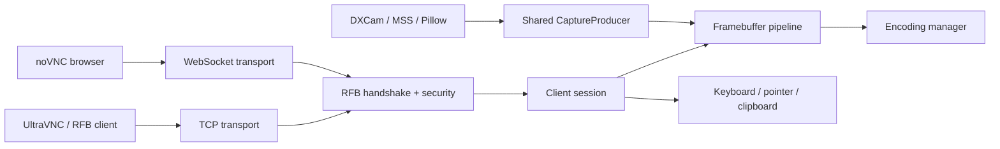

<div align="center">

# PyVNCServer

### A modern, high-performance VNC / RFB server written in Python

RFB 3.8 · UltraVNC interoperability · Tight / ZRLE / Hextile / Zlib · WebSocket / noVNC · multi-client · low-latency capture

<p>
  
  
  
  
  
  
  <a href="https://xulek.github.io/PyVNCServer/"></a>
</p>

**PyVNCServer** is a Python implementation of a VNC/RFB server focused on protocol correctness, practical client interoperability, low-latency desktop streaming and a security-conscious default configuration.

[**Documentation**](https://xulek.github.io/PyVNCServer/) · [**GitHub**](https://github.com/xulek/PyVNCServer)

</div>

---

## Why PyVNCServer?

PyVNCServer is designed for projects that need more control than a black-box VNC server provides. The protocol stack, capture pipeline, encoding selection and connection lifecycle are all implemented in Python and can be extended or embedded directly.

Highlights:

- **RFB 3.8 server implementation** with standard VNC client negotiation.
- **UltraVNC-tested interoperability**, including targeted Tight and RRE compatibility fixes.
- Multiple framebuffer encoding paths: **Raw, CopyRect, RRE, Hextile, Zlib, Tight and ZRLE**.
- Optional **JPEG** and **H.264** extension paths.
- **Adaptive encoding selection** based on client capabilities, changed regions and network profile.
- **Per-client adaptive streaming** with dynamic FPS, CPU/network pressure detection, bottleneck-aware encoding order and safe Tight/JPEG tuning.
- One **shared capture producer** for multiple clients instead of independently capturing the desktop per connection.
- Windows-oriented fast capture through **DXCam/DXGI** when available, with native dirty/move metadata and **MSS** / **Pillow** fallbacks.
- **WebSocket transport** suitable for binary noVNC connections.
- Modern RFB extensions: **ContinuousUpdates**, **Fence**, **LastRect** and **ExtendedDesktopSize**.
- Basic **multi-monitor virtual-desktop capture** through MSS with ExtendedDesktopSize screen reporting.
- Keyboard, pointer and clipboard handling.
- Read-only authentication mode.
- Per-IP connection and authentication throttling.
- **VeNCrypt 0.2** with X509None/X509Vnc and optional TLSNone/TLSVnc compatibility modes.
- Optional legacy direct TLS transport.
- Metrics, health checks and session instrumentation.
- **Operational CLI** with `doctor`, config lifecycle, capture benchmark and local release checks.
- Optional **Prometheus/health/readiness/status HTTP endpoint** for production deployments.
- Configurable **clipboard direction, byte limits and opt-in UTF-8 interoperability mode**.
- Test suite covering protocol, encoders, WebSocket handling, security, capture and end-to-end RFB communication.

For the complete guides, configuration reference, architecture and troubleshooting documentation, see **https://xulek.github.io/PyVNCServer/**.

---

## Client compatibility

| Client / transport | Status | Notes |
| --- | --- | --- |
| **UltraVNC Viewer** | ✅ Regression-covered | Tight/RRE fixes retained; Raw/RRE/Hextile/Zlib/ZRLE/Tight switching is covered by end-to-end tests |
| **Standard RFB 3.8 clients** | ✅ Supported | Client must advertise at least one encoding implemented by the server |
| **noVNC / browser clients** | ✅ Supported transport | noVNC is tracked as `web/noVNC`; enable WebSocket and configure an Origin allowlist |
| **Raw TCP VNC** | ✅ Supported | Default transport |
| **VeNCrypt 0.2** | ✅ Protocol + real TLS tested | Security type `19`; X509None/X509Vnc recommended |
| **Legacy TLS-wrapped VNC** | ✅ Optional | Pre-RFB TLS wrapper retained for compatibility |

> [!NOTE]
> `Tight` encoding and `Tight security/capability negotiation` are different concepts. Tight capability negotiation does **not** provide transport encryption by itself.

---

## Quick start

### Requirements

- Python **3.11 or newer**
- Windows, Linux or another platform supported by the selected capture/input backends
- A VNC viewer such as UltraVNC

### Install from source

Clone recursively to initialize the bundled noVNC submodule:

```bash
git clone --recurse-submodules https://github.com/xulek/PyVNCServer.git
cd PyVNCServer
python -m pip install -U pip
python -m pip install -e .
```

If you already cloned the repository without submodules:

```bash
git submodule update --init --recursive
```

For the faster optional capture stack:

```bash
python -m pip install -e ".[performance]"
```

Optional H.264 support:

```bash
python -m pip install -e ".[h264]"
```

Install both:

```bash
python -m pip install -e ".[performance,h264]"
```

### Start the server

```bash
pyvncserver serve
```

The packaged defaults listen on:

```text
127.0.0.1:5900
```

You can also run the package directly:

```bash
python -m pyvncserver serve
```

Use a custom TOML configuration:

```bash
pyvncserver serve --config config/pyvncserver.toml
```

Override the configured log level:

```bash
pyvncserver serve --log-level DEBUG
```

---

## Connecting with UltraVNC

For a local test:

1. Start PyVNCServer.
2. Open UltraVNC Viewer.
3. Connect to `127.0.0.1:5900`.
4. Start with `Auto`, `Tight`, `ZRLE` or `Hextile` as the preferred encoding.

PyVNCServer includes specific UltraVNC interoperability fixes:

- RRE never emits Raw pixel bytes behind an RRE rectangle header.
- Large RRE regions are tiled to keep the encoder bounded and allow safe fallback.
- Tight solid-fill detection checks the actual rectangle instead of relying on sparse sampling.
- Tight zlib reset bits are synchronized when encoder state changes.
- UltraVNC-specific Tight stream reset compatibility can be enabled when required.

Relevant compatibility switches:

```toml
[features]
tight_stream_reset_for_ultravnc = false

[limits]
tight_disable_for_ultravnc = false
```

Use these as troubleshooting switches rather than enabling them automatically for every client.

More details: [UltraVNC documentation](https://xulek.github.io/PyVNCServer/ultravnc/).

---

## noVNC / WebSocket mode

WebSocket support is disabled by default. Enable it explicitly:

```toml
[features]
enable_websocket = true

[websocket]
allowed_origins = [
    "http://127.0.0.1:6080",
    "http://localhost:6080",
]
```

The WebSocket implementation accepts the binary transport used by noVNC and enforces:

- masked client frames,
- frame/message size limits,
- valid control-frame fragmentation rules,
- configurable browser Origin allowlisting,
- bounded handshake size,
- preservation of bytes pipelined after the HTTP upgrade request.

noVNC is tracked as the `web/noVNC` Git submodule. PyVNCServer provides the VNC WebSocket transport; serve the noVNC frontend with your preferred HTTP server or reverse proxy.

More details: [noVNC & WebSocket documentation](https://xulek.github.io/PyVNCServer/novnc/).

---

## Modern RFB extensions (v3.4)

PyVNCServer 3.4 adds protocol support aimed especially at modern viewers and noVNC:

| Extension | ID / message | Status |
| --- | ---: | --- |
| ContinuousUpdates | `-313` / client `150` | ✅ Push-style framebuffer updates |
| Fence | `-312` / `248` | ✅ Negotiation probe + request/response |
| LastRect | `-224` | ✅ Implemented, opt-in by default |
| ExtendedDesktopSize | `-308` | ✅ Layout reporting and resize status |
| SetDesktopSize | client `251` | ✅ Parsed; host resize rejected safely by default |

ContinuousUpdates runs inside the existing per-client session thread, so Tight/Zlib encoder state remains ordered. ExtendedDesktopSize now uses the correct **16-byte SCREEN record** and immediately advertises the current screen layout when negotiated.

---

## Encoding support

| Encoding | ID | Implementation | Typical use |
| --- | ---: | --- | --- |
| Raw | `0` | ✅ | Simple baseline, LAN/debugging |
| CopyRect | `1` | ✅ | Efficient screen movement/scroll-like updates |
| RRE | `2` | ✅ | Flat-color / simple regions |
| Hextile | `5` | ✅ | General compatibility with tiled updates |
| Zlib | `6` | ✅ | General-purpose compressed rectangles |
| Tight | `7` | ✅ | Strong VNC client compatibility and compression |
| ZRLE | `16` | ✅ | Efficient tiled zlib/RLE encoding |
| JPEG path | extension | ✅ Optional path | Image-like content where lossy compression is appropriate |
| H.264 path | extension | ⚙️ Optional | Requires `av`; extension/client support is required |

The server negotiates only encodings advertised by the client and can select different encodings for different update regions.

See the [encoding reference](https://xulek.github.io/PyVNCServer/encodings/) for protocol and fallback details.

---

## Capture pipeline

`capture_backend = "auto"` selects the best available backend.

| Backend | Platform | Notes |
| --- | --- | --- |
| DXCam / DXGI | Windows | Preferred optional high-performance path |
| MSS | Cross-platform | Main portable capture backend |
| Pillow `ImageGrab` | Platform dependent | Fallback capture path |

Install performance extras on Windows to make DXCam available:

```bash
python -m pip install -e ".[performance]"
```

The server-wide `CaptureProducer` captures once and publishes generations of the framebuffer to client sessions. This avoids scaling capture work linearly with the number of connected clients.

> [!IMPORTANT]
> On Windows with DXCam 0.3.0+, PyVNCServer can harvest native DXGI dirty/move rectangles. If metadata cannot be read safely, it falls back to the software change detector instead of assuming that the screen did not change.

---

## Multi-monitor mode (v3.4)

Combined desktop capture is available through MSS:

```toml
[server]
capture_backend = "auto"
capture_all_monitors = true
monitor_index = 0
```

When enabled with `capture_backend = "auto"`, PyVNCServer prefers MSS monitor `0`, which represents the virtual desktop spanning all displays. Physical monitor coordinates are normalized to the RFB framebuffer origin and reported through ExtendedDesktopSize.

DXCam still captures one DXGI output per camera; use MSS/auto for a combined multi-monitor framebuffer.

---

## Security model

PyVNCServer deliberately uses conservative defaults.

### Default behavior

```toml
[server]
host = "127.0.0.1"
port = 5900
handshake_timeout = 5.0
max_connections = 10
max_connections_per_ip = 4
max_unauthenticated_connections = 4

[security]
password = ""
read_only_password = ""
allow_insecure_no_auth = false
```

The server refuses an unauthenticated non-loopback bind unless you explicitly opt into it.

### Classic VNC authentication caveat

Classic VNC authentication:

- uses the legacy VNC DES challenge/response mechanism,
- effectively uses only the first **8 password bytes**,
- authenticates the client but does **not encrypt framebuffer, keyboard or pointer traffic**.

For untrusted networks, prefer **VeNCrypt X509Vnc**, SSH tunnelling or a VPN.

### VeNCrypt 0.2 (recommended)

VeNCrypt is negotiated as normal RFB security type `19`; TLS begins only after the client selects a VeNCrypt subtype.

Recommended password-authenticated configuration:

```toml
[security]
password = "secret"

vencrypt_enabled = true
vencrypt_subtypes = ["x509-vnc"]
tls_cert_file = "server.crt"
tls_key_file = "server.key"
tls_minimum_version = "1.2"
require_encrypted_transport = true
```

Supported v3.5 subtypes:

| VeNCrypt subtype | ID | User authentication | Server identity |
| --- | ---: | --- | --- |
| X509None | `260` | none | X.509 certificate |
| X509Vnc | `261` | classic VNC auth inside TLS | X.509 certificate |
| TLSNone | `257` | none | anonymous TLS |
| TLSVnc | `258` | classic VNC auth inside TLS | anonymous TLS |

`TLSNone` / `TLSVnc` are legacy anonymous-TLS compatibility modes and are disabled unless `vencrypt_allow_anonymous_tls = true`.

If a VNC password exists, PyVNCServer will not offer a `*None` subtype unless `vencrypt_allow_no_auth_with_password = true` is explicitly set. This prevents accidentally turning encryption into an authentication bypass.

### Legacy direct TLS

The old pre-RFB TLS wrapper remains available:

```toml
[security]
tls_enabled = true
tls_cert_file = "server.crt"
tls_key_file = "server.key"
tls_minimum_version = "1.2"
```

`tls_enabled` and `vencrypt_enabled` are intentionally mutually exclusive.

### Authentication throttling

```toml
[security]
auth_max_failures = 5
auth_failure_window_seconds = 30.0
auth_backoff_max_seconds = 2.0
```

Additional protections include connection admission limits, handshake timeouts and WebSocket payload limits.

See the full [security guide](https://xulek.github.io/PyVNCServer/security/).

---

## Configuration

The safe packaged configuration is stored in:

```text
src/pyvncserver/default_config.toml
```

A project-level example is available at:

```text
config/pyvncserver.toml
```

Important options:

```toml
[server]
host = "127.0.0.1"
port = 5900
frame_rate = 30
lan_frame_rate = 90
network_profile_override = "auto"
scale_factor = 1.0
capture_backend = "auto"
monitor_index = 0
capture_all_monitors = false
max_connections = 10
input_control_policy = "single-controller"

[features]
enable_region_detection = true
enable_metrics = true
enable_request_coalescing = true
enable_lan_adaptive_encoding = true
enable_websocket = false
enable_copyrect_encoding = true
enable_zrle_encoding = true
enable_tight_encoding = true
enable_jpeg_encoding = true
enable_h264_encoding = false
enable_parallel_encoding = true
enable_capture_producer = true
enable_dxgi_metadata = true
enable_continuous_updates = true
enable_fence = true
enable_last_rect = false
enable_extended_desktop_size = true
allow_client_resize = false

[adaptive]
enabled = true
min_fps = 12
target_utilization = 0.80
merge_regions = true
cache_enabled = true
reorder_encodings = true
adapt_tight_compression = true

[limits]
encoding_threads = 0
max_set_encodings = 1024
max_client_cut_text = 16777216
```

`network_profile_override = "auto"` allows the server to classify the connection instead of forcing LAN tuning for every client.

The complete option reference is available in the [configuration documentation](https://xulek.github.io/PyVNCServer/configuration/).

---

## Architecture



### Main modules

```text
src/pyvncserver/
├── app/
│   └── server.py              listener, admission, auth, lifecycle
├── session/
│   ├── loop.py                per-client RFB message loop
│   └── runtime.py             framebuffer / encoding session helpers
├── platform/
│   └── producer.py            shared framebuffer producer
├── runtime/
│   ├── adaptive.py            per-client congestion control + encoded-region cache
│   ├── security.py            per-IP limits and auth throttling
│   ├── connection_limiter.py
│   └── connection_registry.py
├── rfb/                       structured RFB subpackage
├── observability/             metrics / logging / profiling facades
├── plugins/                   capture / encoding / security plugin contracts
├── capture.py                 stable capture facade
├── encodings.py               stable encoding facade
├── protocol.py                stable protocol facade
├── security.py                stable security facade
├── errors.py                  stable exception facade
├── config.py                  validated TOML configuration
├── cli.py                     command-line entry point
└── _core/                     private implementation detail
```

---

### Observability

```toml
[observability]
prometheus_enabled = true
prometheus_host = "127.0.0.1"
prometheus_port = 9100
```

This exposes `/metrics`, `/healthz`, `/readyz` and `/status`. The observability listener is disabled by default.

### Clipboard policy

```toml
[clipboard]
enabled = true
direction = "both"
max_bytes = 1048576
encoding = "latin-1"
```

`utf-8` can be enabled explicitly when both endpoints agree on it; Latin-1 remains the compatibility default.

---

## Performance design

The server contains several latency and throughput optimizations:

- shared capture producer,
- generation-aware framebuffer updates,
- dirty-region detection,
- request coalescing,
- network-profile-aware encoding selection,
- per-client adaptive FPS/backpressure,
- CPU-vs-network bottleneck detection,
- pressure-aware dirty-region merging,
- bottleneck-aware encoding reordering,
- shared TTL/LRU encoded-region cache for stateless encodings,
- parallel region encoding,
- bounded RRE tiling,
- configurable Zlib/ZRLE compression levels,
- adaptive JPEG quality and safe Tight compression tuning,
- capture backend probing/fallback,
- LAN-specific frame-rate tuning.

The goal is to avoid spending CPU on full-frame work when only a small part of the desktop changed.

---

## Tests

Install development dependencies and run the complete suite:

```bash
python -m pip install -e ".[dev]"
python -m pytest -q
```

Current 4.0.0 verification result:

```text
417 passed, 13 skipped
```

The skipped cases in the recorded verification environment are legacy/auth compatibility cases and do not affect Tight/RRE tests.

The suite includes coverage for:

- RFB protocol negotiation,
- VNC authentication and utilities,
- encoding correctness,
- Tight/RRE regressions,
- WebSocket framing and hostile input cases,
- configuration fail-closed behavior,
- per-IP security limits,
- change detection,
- capture producer behavior,
- framebuffer/session logic,
- packaging exports,
- end-to-end RFB loopback communication,
- 4.0 package-boundary enforcement,
- capture/encoding/security plugin integration,
- encrypted-transport fail-closed behavior for security plugins.

### Syntax/bytecode check

```bash
python -m compileall -q src tests
```

---

## Verification

Run the full suite:

```bash
python -m pip install -e ".[dev]"
python -m pytest -q
python -m compileall -q src tests
```

---

## GitHub Actions

The repository currently contains these workflow definitions:

| Workflow | Purpose |
| --- | --- |
| `CI` | Tests Python 3.11–3.13, includes a Windows test job, checks bytecode compilation, coverage and package builds |
| `Documentation` | Strictly builds MkDocs documentation on PRs and deploys GitHub Pages from `main` |

---

## Development workflow

```bash
python -m venv .venv
```

Activate it:

**Windows PowerShell**

```powershell
.\.venv\Scripts\Activate.ps1
```

**Linux / macOS**

```bash
source .venv/bin/activate
```

Install the project:

```bash
python -m pip install -U pip
python -m pip install -e ".[dev,performance]"
```

Run verification before committing:

```bash
python -m compileall -q src tests
python -m pytest -q
```

Build distributions:

```bash
python -m pip install build twine
python -m build
python -m twine check dist/*
```

---

## Known limitations / roadmap

- DXCam currently captures one DXGI output per camera; combined multi-monitor capture uses MSS virtual-desktop mode.
- `allow_client_resize` does not change the host display mode; v3.4 only accepts layout-only changes matching the current framebuffer size.
- Fence `SyncNext` is parsed but not implemented as a deferred barrier.
- LastRect is implemented but disabled by default for conservative compatibility.
- H.264 is an optional extension path and requires compatible client-side support.
- Classic VNC authentication remains an 8-byte legacy password mechanism; use it inside VeNCrypt X509Vnc when possible.
- Browser use requires a separately served noVNC frontend/static HTTP endpoint.
- VeNCrypt is negotiated on raw RFB/TCP. Browser WebSocket deployments should use WSS/direct TLS or a TLS-terminating reverse proxy.
- The private `pyvncserver._core` namespace is not a public API; use the documented 4.x facades instead.

---

<div align="center">

**PyVNCServer 4.0.0** · Python 3.11+ · RFB 3.8 · [Documentation](https://xulek.github.io/PyVNCServer/)

</div>
