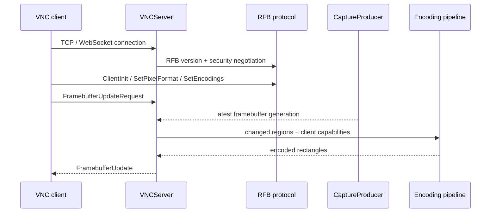

# Architecture

PyVNCServer separates listener/session orchestration from reusable protocol, capture, runtime and encoding components while retaining `vnc_lib` as a compatibility implementation layer.

## Runtime flow



## Main package layout

```text
src/pyvncserver/
├── app/server.py              listener, admission, authentication, lifecycle
├── session/                   per-client state and message/update loop
├── platform/                  capture producer and platform integration facade
├── runtime/                   limits, registry, network/runtime helpers
├── rfb/                       public RFB protocol facade
├── observability/             logging, metrics and profiling facade
├── config.py                  typed TOML loading and fail-closed validation
├── default_config.toml        packaged safe defaults
└── cli.py                     pyvncserver command

src/vnc_lib/                   protocol/encoder compatibility implementation layer
```

## Capture model

With `enable_capture_producer = true`, one server-wide producer captures the desktop and publishes monotonically newer framebuffer generations. Client sessions consume the newest appropriate generation instead of independently serializing capture calls.

Benefits:

- capture work does not scale linearly with client count;
- slow clients do not force every other client to capture at their pace;
- changed-region history can be associated with produced frames.

## Session state

Per-client state includes negotiated pixel format, client-advertised encodings, framebuffer request state, input-control state and encoder/session-specific state. Keeping this scoped to the connection prevents one viewer's negotiation from mutating another viewer's protocol state.

## Encoding pipeline

The framebuffer path can:

1. obtain the latest frame;
2. determine whether the request is full or incremental;
3. collect or detect changed regions;
4. split large/problematic regions where required;
5. choose only from negotiated encodings;
6. encode regions, optionally in parallel;
7. send one RFB FramebufferUpdate containing consistent rectangle headers/payloads.

## Compatibility layer

`src/vnc_lib/` remains in the repository because existing implementation and import paths still depend on it. Public package exports are provided through `pyvncserver`; future refactors can move implementation behind those public modules without forcing downstream callers to follow every internal reorganization.
