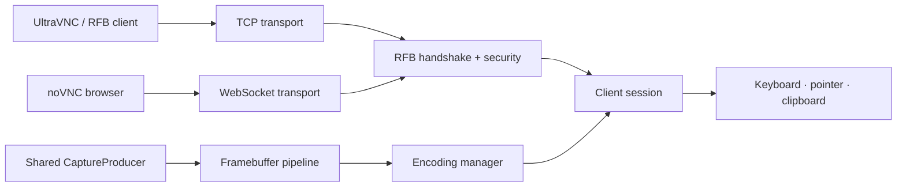

<div class="hero" markdown>

<div class="eyebrow">RFB 3.8 · Python 3.11+ · UltraVNC · noVNC</div>

# Remote framebuffer, under your control.

<p class="lead">PyVNCServer is a modern VNC/RFB server written in Python, built for protocol correctness, practical client interoperability, low-latency desktop capture and an implementation you can actually inspect and extend.</p>

<div class="hero-actions">
  <a class="md-button md-button--primary" href="getting-started/">Get started</a>
  <a class="md-button" href="https://github.com/xulek/PyVNCServer">View on GitHub</a>
</div>

<div class="status-row">
  <span class="status-pill">RFB 3.8</span>
  <span class="status-pill">UltraVNC tested</span>
  <span class="status-pill">Tight · ZRLE · Hextile · Zlib</span>
  <span class="status-pill">WebSocket / noVNC</span>
  <span class="status-pill">Safe defaults</span>
</div>

</div>

<div class="feature-grid" markdown>

<div class="feature-card" markdown>
<span class="feature-icon">⚡</span>
### Low-latency pipeline
Shared capture production, incremental region detection, request coalescing and adaptive encoding keep avoidable work off the hot path.
</div>

<div class="feature-card" markdown>
<span class="feature-icon">🧩</span>
### Real RFB encodings
Raw, CopyRect, RRE, Hextile, Zlib, Tight and ZRLE are available, with optional JPEG and H.264 extension paths.
</div>

<div class="feature-card" markdown>
<span class="feature-icon">🖥️</span>
### UltraVNC interoperability
The server contains targeted fixes for Tight stream state and RRE fallback behavior discovered during UltraVNC compatibility testing.
</div>

<div class="feature-card" markdown>
<span class="feature-icon">🌐</span>
### Browser transport
Binary WebSocket transport supports noVNC-style browser connections with Origin allowlisting and bounded frame/message sizes.
</div>

<div class="feature-card" markdown>
<span class="feature-icon">🔒</span>
### Security-conscious defaults
Loopback binding, fail-closed configuration validation, TLS support, authentication throttling and connection admission limits are built in.
</div>

<div class="feature-card" markdown>
<span class="feature-icon">🔬</span>
### Inspectable by design
The protocol, capture, session, encoding and transport layers are Python code rather than a black-box native server.
</div>

</div>

## Run it

```bash
# clone and install
git clone https://github.com/xulek/PyVNCServer.git
cd PyVNCServer
python -m pip install -e .

# start with the packaged safe configuration
pyvncserver serve
```

The default bind is `127.0.0.1:5900`. To expose the server on another interface, configure authentication or explicitly opt into unauthenticated non-loopback operation. See [Security](security.md).

## How the pieces fit together



## Choose your path

| I want to… | Go to |
| --- | --- |
| install and connect for the first time | [Installation & quick start](getting-started.md) |
| understand every TOML option | [Configuration](configuration.md) |
| tune or debug UltraVNC | [UltraVNC guide](ultravnc.md) |
| connect a browser/noVNC client | [noVNC & WebSocket](novnc.md) |
| compare encodings | [Encoding reference](encodings.md) |
| expose the server beyond localhost | [Security](security.md) |
| understand internals | [Architecture](architecture.md) |
| profile or benchmark the server | [Performance](performance.md) |
