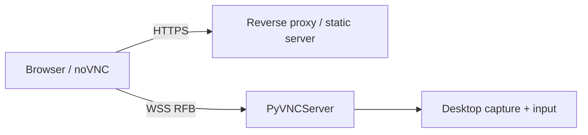

# noVNC & WebSocket

PyVNCServer can transport RFB over a binary WebSocket connection for browser/noVNC-style clients.

## Enable WebSocket detection

```toml
[features]
enable_websocket = true

[websocket]
allowed_origins = [
  "http://127.0.0.1:6080",
  "http://localhost:6080",
]
```

The allowlist should contain the exact browser Origin(s) serving your frontend.

## Security properties

The WebSocket implementation enforces or bounds:

- masked client frames;
- handshake size;
- individual payload size;
- assembled message size;
- buffering;
- control-frame fragmentation rules;
- browser Origin allowlisting;
- bytes pipelined immediately after the HTTP Upgrade request.

!!! warning
    WebSocket is a transport framing layer, not encryption. Use TLS (`wss://`) or another protected tunnel when traffic crosses an untrusted network.

## noVNC frontend

noVNC is tracked as the `web/noVNC` Git submodule. Clone recursively when you want the browser client assets:

```bash
git clone --recurse-submodules https://github.com/xulek/PyVNCServer.git
```

For an existing checkout:

```bash
git submodule update --init --recursive
```

Serve the noVNC frontend with a normal static HTTP server or reverse proxy and point it at the PyVNCServer WebSocket endpoint.

A typical topology is:



## Payload limits

Defaults:

```toml
[websocket]
max_handshake_bytes = 65536
max_payload_bytes = 8388608
max_buffer_bytes = 16777216
max_message_bytes = 16777216
```

Keep `max_message_bytes >= max_payload_bytes`; configuration validation rejects an inconsistent value.

## Troubleshooting

If the TCP viewer works but noVNC does not:

1. verify `enable_websocket = true`;
2. verify the `web/noVNC` submodule is initialized;
3. inspect the browser console for Origin/Upgrade failures;
4. ensure the Origin is explicitly allowlisted;
5. confirm the frontend is using binary WebSocket RFB transport;
6. if TLS terminates at a reverse proxy, verify the proxy forwards Upgrade/Connection headers.
